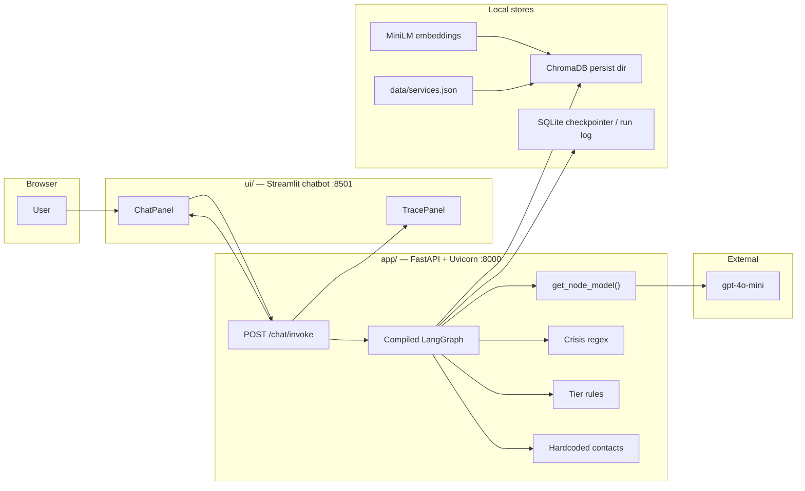
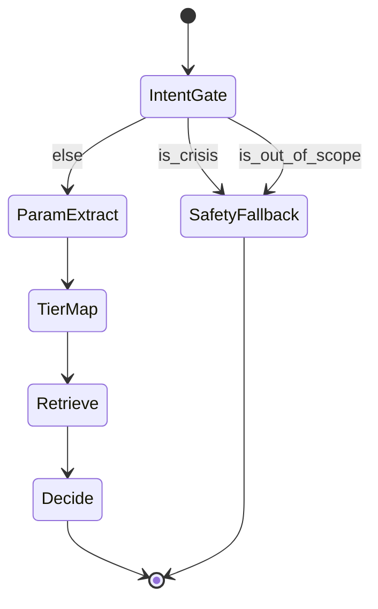
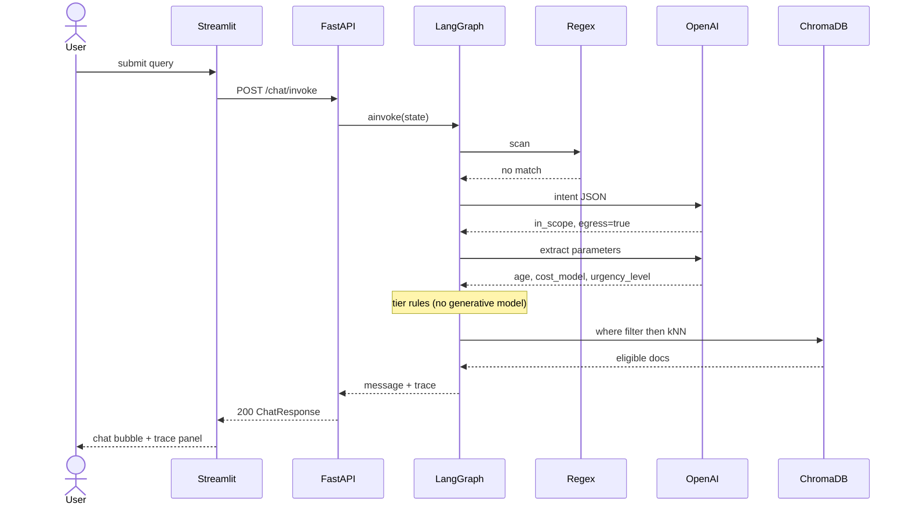
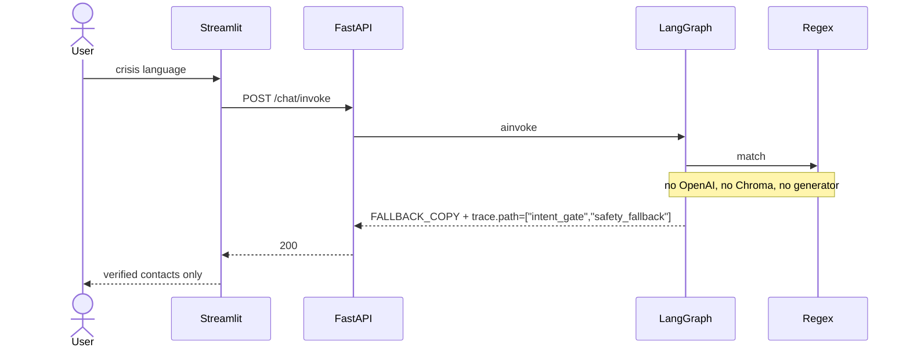
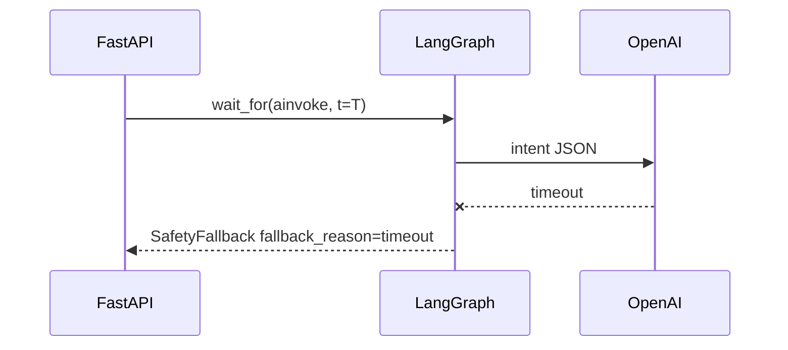
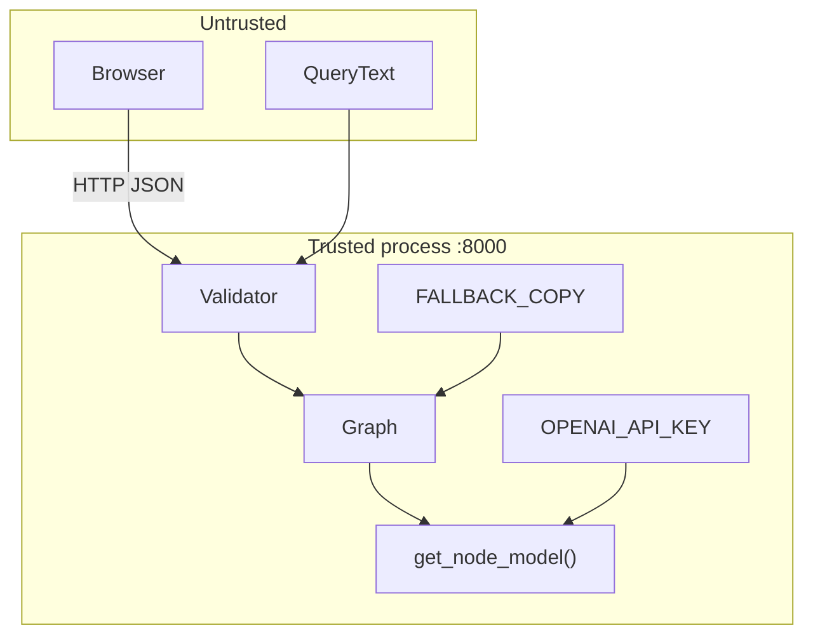

# System design

Architecture for the Singapore Mental Health Service Navigator chatbot. Product intent, provider catalogue, `GraphState` fields, node responsibilities, KPIs, and build steps live in the [root README](../README.md) and [project plan](./project-plan.md). This document specifies **how processes, contracts, and data stores fit together**—not what the product is for.

---

## 1. Design constraints (engineering)

| Constraint | Implication |
|------------|-------------|
| Two-process app | Streamlit never imports the graph or holds `OPENAI_API_KEY`. All model and retrieval I/O is behind FastAPI. Same contract when publicly hosted. |
| Structured OpenAI only | Nodes 1–2 go through `get_node_model()` in `app/graph/models.py` (`gpt-4o-mini`). Optional `OPENAI_BASE_URL` for a private/regional endpoint. Models fill JSON; they do not choose edges. |
| Regex can skip the LLM | First-person crisis regex never sends the utterance to OpenAI (`egress=false`). All other Node 1–2 calls set `egress=true`. |
| Deterministic control flow | Edges are predicates on `GraphState` booleans. Models may **fill fields**; they may not **choose the next node**. |
| Fail closed on safety | Regex, timeout, malformed structured output, and API crash all converge on the hardcoded fallback payload. |
| Trace is a first-class output | The API response is invalid if `trace` is missing or if `path` is empty. The UI must not invent trace rows. Record `model_backend` and `egress`. |
| Curated corpus only | Retrieval never hits the open web. Ingest is a batch from `data/services.json`. |
| Ephemeral sessions (MVP) | One HTTP request = one graph run. No multi-turn memory in the graph. Streamlit may keep *display* history only. |

---

## 2. Runtime topology

Two OS processes on loopback (or two containers in production). Eval and pytest are a third consumer of the same API (or of the compiled graph in-process for unit tests).



**Why this split:** Streamlit reruns the script on every widget event. Binding the graph to the UI process would re-enter model calls, leak secrets into the frontend process, and make `eval.py` depend on a browser session. FastAPI owns a single compiled graph instance (module-level or lifespan) and exposes a stable contract.

**Startup order:** ingest (if Chroma collection empty) → compile graph → bind Uvicorn → start Streamlit pointing at `http://127.0.0.1:8000`.

---

## 3. Component responsibilities

| Component | Owns | Must not own |
|-----------|------|----------------|
| [`ui/`](../ui/README.md) | Layout, chat history in `st.session_state`, spinner, rendering of `trace` | Prompts, regex, provider ranking, API keys |
| [`app/`](../app/README.md) HTTP layer | Validation, timeouts, mapping graph output → `ChatResponse`, `/health` | Widget state |
| LangGraph compiler | Node functions, conditional edges, appending to `reasoning_trace` | HTTP status codes |
| `app/graph/models.py` | `get_node_model(task_type)`; OpenAI JSON; `egress` flags | Choosing the next graph node |
| [`rag/`](../rag/README.md) | Embed + upsert by `service_id`, flatten `contact`, metadata `where` then k-NN | Crisis detection |
| SQLite | Optional LangGraph checkpointer thread_id; optional eval run ids | Emergency phone numbers |
| `gpt-4o-mini` | Intent JSON + parameter JSON | Final user-visible crisis copy |
| MiniLM | Catalogue and query embeddings | Intent labels |

Module sketch (implementation may rename files; the **boundaries** are the design):

```text
app/
  main.py            # FastAPI app, CORS not required for same-machine Streamlit
  schemas.py         # ChatRequest / ChatResponse / TraceEvent
  graph.py           # StateGraph compile
  state.py           # GraphState (see project plan §3.1)
  graph/models.py    # get_node_model(); OpenAIStructuredClient
  nodes/             # one module per node; no FastAPI imports
  safety.py          # regex + FALLBACK_COPY constants
  timeouts.py        # asyncio.wait_for around model calls
rag/
  ingest.py          # idempotent upsert by service_id; flatten contact
  retrieve.py        # where-filter then query; is_hard_stop_only == false
  chroma_client.py   # MiniLM embedding function shared by ingest and query
ui/
  app.py             # Streamlit entry
  api_client.py      # httpx to /chat/invoke
```

---

## 4. HTTP contracts

### 4.1 `POST /chat/invoke`

Request (Pydantic). Extra fields rejected.

```json
{
  "query": "I am 18, have no income, and feel overwhelmed",
  "request_id": "optional-uuid"
}
```

| Field | Rules |
|-------|--------|
| `query` | Required; strip; max length bounded (e.g. 2000 chars) to cap token cost and prompt injection surface |
| `request_id` | Optional; echoed in `trace` for eval alignment |

Response: HTTP 200 for **all handled routing outcomes**, including crisis and out-of-scope. Those are product successes, not transport errors.

```json
{
  "request_id": "…",
  "message": "…user-facing text…",
  "trace": {
    "path": ["intent_gate", "param_extract", "tier_map", "retrieve", "decide"],
    "active_node": "decide",
    "is_crisis": false,
    "is_out_of_scope": false,
    "intent_confidence": 0.86,
    "model_backend": "cloud",
    "egress": true,
    "parameters": { "age": 18, "cost_model": "Free", "urgency_level": "routine", "category": "Youth Assessment & Navigation" },
    "tier": "Tier 1-2",
    "citations": [
      {
        "service_id": "sg-chat-01",
        "title": "CHAT",
        "distance": 0.21,
        "metadata": { "cost_model": "Free", "age_min": 16, "age_max": 30 }
      }
    ],
    "latency_ms": { "intent_gate": 420, "retrieve": 35, "total": 980 },
    "fallback_reason": null
  }
}
```

`citations` must be documents **actually returned by Node 4**, not model-invented names.

### 4.2 Transport errors (not routing outcomes)

| Status | When |
|--------|------|
| `422` | Empty / oversized `query` |
| `504` | Whole-graph deadline exceeded; body still includes hardcoded fallback if the timeout handler ran |
| `503` | Chroma collection missing and ingest has not run |
| `500` | Uncaught exception after fallback construction failed |

### 4.3 `GET /health`

Liveness: process up. Readiness: graph compiled **and** collection count ≥ 1 (or ≥ 8 after ingest). Streamlit should disable send until readiness is true.

---

## 5. Control-flow graph (predicates only)

Node *semantics* are in [project plan §3.2](./project-plan.md#32-node-execution-workflow). Below is the **edge algebra** the compiler must implement.



| Edge | Predicate (evaluated in Python, not by the model) |
|------|--------------------------------------------------|
| IntentGate → SafetyFallback | `is_crisis or is_out_of_scope` |
| IntentGate → ParamExtract | `not is_crisis and not is_out_of_scope` |
| All other sequential edges | Unconditional |

**Ordering inside IntentGate (single node, two stages):**

1. Regex on normalised text (lowercase, collapsed whitespace). Match ⇒ set `is_crisis=True` and **skip all model calls**.
2. Else `get_node_model("intent")` — one `gpt-4o-mini` JSON call. Parse failure or API timeout → fail-closed: `fallback_reason="llm_unavailable"` still routes to SafetyFallback (crisis-shaped copy is acceptable; unconstrained generation is not).

Out-of-scope is **never** inferred by regex of clinical jargon alone (too many false positives on “anxiety”). It is structured model output plus optional keyword hints that *raise* prior, not auto-fire.

---

## 6. Sequence: three product paths

### 6.1 In-scope navigation



### 6.2 Crisis hard stop



If regex misses and `gpt-4o-mini` sets `is_crisis`, the same SafetyFallback node runs; Chroma and the decision generator still must not run.

### 6.3 Deadline / model outage



`T` is a process-wide budget (target perceived latency: see project plan Step 11). Nested model calls share that budget; Parameter Extraction must not start if remaining time is below a floor. API crash is treated the same as timeout: hardcoded fallback, no conversational generation.

---

## 7. Data stores

### 7.1 `services.json` document schema

The catalogue *contents* are listed in the [project plan](./project-plan.md#33-indexed-providers). Authoritative JSON Schema: [`data/schemas/services.schema.json`](../data/schemas/services.schema.json). Retrieval depends on **stable metadata names** after ingest flattens nested `contact`:

| Field (source JSON) | Type | Used by |
|-------|------|---------|
| `service_id` | string, unique (`^sg-[a-z0-9-]+$`) | upsert key, citation id |
| `name` | string | display |
| `tier_labels` | `["1"…"4"]` | ranking |
| `category` | six-value enum | optional `where` / extracted need |
| `age_min`, `age_max` | int 0–120 | `where` filter |
| `cost_model` | enum `Free` \| `Subsidized` \| `Private` \| `Variable` | `where` filter |
| `urgency_level` | enum `routine` \| `sub-acute` \| `acute` \| `emergency` | filter / ranking |
| `access_pathway` | string | Node 5 copies this into `message`; model must not rewrite phone numbers inside it |
| `summary` | string, max 300 | embedded text |
| `contact.website`, `contact.phone`, `contact.operating_hours` | string or null | flatten to `contact_website` / `contact_phone` / `contact_operating_hours` in Chroma |
| `contact.location_type` | five-value enum | flatten to `location_type` in Chroma |
| `is_hard_stop_only` | bool | Tier 4 rows: never returned from Node 4; they exist in JSON for ingest completeness and for eval gold labels, not for kNN |

Embed `name + summary + access_pathway` (not phone fields as the sole vector). Keep phones in `contact.phone` **and** in `safety.py` constants; Node 6 reads constants only.

### 7.2 Chroma collection

- One collection, e.g. `sg_mh_services`.
- Distance: cosine.
- Embedding model: same function at ingest and query. Default local `all-MiniLM-L6-v2` (`EMBEDDING_MODEL`). Changing the model requires a full re-ingest.
- Persist directory: local path gitignored (see [`.gitignore`](../.gitignore)); recreate via `rag/ingest.py`.
- Query path: `collection.query(where=..., query_embeddings=..., n_results=k)` with `k` small (3 is enough for eight docs). If `where` matches zero documents, return empty list and let Node 5 emit a **navigation** empty-state (e.g. national mindline as default Tier 1), never a fabricated provider.

### 7.3 SQLite

Use a **narrow** role so it does not duplicate Chroma:

| Table / store | Purpose |
|---------------|---------|
| LangGraph `SqliteSaver` (optional) | Replay a `thread_id` during debugging; **not** required for the dual-panel demo |
| `eval_runs` (optional) | Persist `request_id`, gold `service_id`, predicted `service_id`, `egress`, latencies for Step 10 |

Do not store user queries long-term in the MVP; eval fixtures live as files under [`eval/`](../eval/README.md).

---

## 8. Trace protocol (UI binding)

The right panel is a **pure function of `trace`**. Suggested rows:

1. `path` as a breadcrumb (highlight `active_node`)
2. Flags: `is_crisis`, `is_out_of_scope`, `fallback_reason`, `model_backend`, `egress`
3. `intent_confidence` (hide or show “n/a” on regex-only crisis)
4. Extracted parameters (JSON, pretty-printed)
5. `tier`
6. Citations: `service_id`, metadata chips, distance

If `is_crisis`, citations stay empty by contract. Filling them would imply retrieval ran.

Each node appends `{ "node", "t_ms", "note" }` to an internal list that serialises into `path` + `latency_ms`. Nodes must not overwrite earlier path entries.

---

## 9. Latency budget

End-to-end target is in the [project plan](./project-plan.md#step-11--system-tuning-and-ux). Split for design (not a KPI):

| Hop | Budget hint | Notes |
|-----|-------------|--------|
| Regex | < 5 ms | Always first |
| Intent (`gpt-4o-mini`) | majority of Node 1 | Skip entirely on regex crisis |
| Extract (`gpt-4o-mini`) | remainder of model budget | Skip entirely on crisis / out-of-scope |
| Tier rules | < 1 ms | |
| Chroma | ~10% | Local MiniLM; warm collection |
| Decide | template fill, no generative model on MVP | Keeps tail latency and hallucination off the message |
| HTTP + Streamlit | remainder | Spinner covers this |

Node 5 should be **templated** (constraints + citation + `access_pathway`). A second generative call for “warmer tone” is out of scope and fights the latency budget.

---

## 10. Security and trust boundary



- Streamlit may log `request_id` and display `message`; it must not log raw API keys.
- Regex crisis: `trace.egress=false`. OpenAI intent/extract: `trace.egress=true`.
- User text is only interpolated into **fixed** prompt templates as a JSON string field, never concatenated into instructions that say “ignore previous”.
- No tool-calling that can fetch URLs.
- CORS default-deny; Streamlit uses server-side `httpx`, not the browser, to call FastAPI (avoids exposing the API to arbitrary origins).
- Public traffic needs a privacy notice and retention policy before it is more than a prototype.

---

## 11. Test and eval seams

| Seam | Caller | What it proves |
|------|--------|----------------|
| `safety.regex` unit | [`tests/`](../tests/README.md) | Keyword hits without any model |
| `get_node_model` | pytest | Returns the OpenAI structured client |
| Node functions with mocked models | pytest | Edge predicates, empty Chroma, schema parse failure, `egress` on cloud path |
| `POST /chat/invoke` | pytest + httpx | Payload shape; crisis regex path does not call a mocked OpenAI client |
| Compiled graph in-process | [`eval/`](../eval/README.md) | Same 30 cases as HTTP, lower overhead |
| Two-config eval | eval | (1) unconstrained `gpt-4o-mini` (2) Navigator chatbot |

Eval must not scrape Streamlit. The UI is out of the accuracy loop; Trace Transparency is checked by asserting `trace` keys on the API (and a thin UI test only if needed later).

---

## 12. Configuration

| Variable | Where used |
|----------|------------|
| `OPENAI_API_KEY` | Nodes 1–2 structured JSON |
| `OPENAI_MODEL` | Default `gpt-4o-mini` |
| `OPENAI_BASE_URL` | Optional private / regional OpenAI-compatible endpoint |
| `EMBEDDING_MODEL` | Pin; must match ingested vectors (default `all-MiniLM-L6-v2`) |
| `CHROMA_PATH` | Persist dir; default repo-root `chroma/` (gitignored). Resolved from the repo, not cwd. |
| `API_DEADLINE_S` | `wait_for` around `ainvoke` |
| `NAVIGATOR_API_URL` | Streamlit client, default `http://127.0.0.1:8000` |

Loaded via environment / `.env` at the **repo root** on the **API** process. Copy [`.env.example`](../.env.example). Streamlit needs only `NAVIGATOR_API_URL`.

LLM `confidence` fields are uncalibrated. Crisis is fail-closed on the **label** (and first-person regex). Diagnostic suppressors around 0.55 must not be used to drop navigation. Policy: [project plan — confidence scores](./project-plan.md#confidence-scores-policy).

---

## 13. What this design deliberately omits

- Auth, multi-tenant isolation, production hosting (needed before real public traffic)
- Streaming tokens to the chat pane (trace completeness is easier on a single JSON response)
- Multi-turn conversational memory
- Open-web or mindline.sg scraping
- Replacing the Streamlit + FastAPI two-process chatbot with a heavier frontend
- On-device or operator-loopback LLM inference

Those would change the trust boundary and the eval story. Inference stays behind FastAPI.
